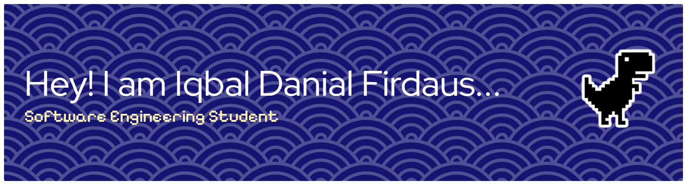

<!-- <h1 align="center"><b>Hi , I'm Iqbal Danial </b></h1> -->

## <picture></picture> About me

<picture> </picture>

  

- :school: I am a `Final Year Student` at [Faculty of Computers Science & Information Technology](http://suez.edu.eg/ar/%d9%83%d9%84%d9%8a%d8%a9-%d8%a7%d9%84%d8%ad%d8%a7%d8%b3%d8%a8%d8%a7%d8%aa-%d9%88%d8%a7%d9%84%d9%85%d8%b9%d9%84%d9%88%d9%85%d8%a7%d8%aa/) at [ University of Malaya](http://suez.edu.eg/ar/).
- :student: I’m currently taking a bachelor in `Software Engineering`.
- :nerd_face: Always `learning new things`.
 

## <picture>  </picture> Connect with me

	
	
	
	

## 🛠️ My Skills

### <picture>   </picture> Programming languages

 
  &emsp; 
  
  &emsp;
 
  &emsp;
  
  &emsp;

  &emsp;
  

### <picture>   </picture> Frontend & Framework 

 

  &emsp;
  
  &emsp;
  
  &emsp;
  
  &emsp;
  
  &emsp;
   &emsp;
   &emsp;
   &emsp;
   &emsp;
   &emsp;
   &emsp;
   &emsp;

 ### <picture>   </picture> Software & Tools
 

    
  

   &emsp;
  
  &emsp;

 ### <picture>   </picture> IDEs
 

  &emsp;

  &emsp;
  &emsp;
  &emsp;
  &emsp;
  &emsp;

 ### <picture>   </picture> Operating Systems
 

  &emsp;
  
 &emsp;
 &emsp;
 &emsp;

  

### &nbsp;<i><b>Git Activeness</b></i>

 

&nbsp;

     

##  My Contributions Graph 🐍

<!--
**iqbaldanial/iqbaldanial** is a ✨ _special_ ✨ repository because its `README.md` (this file) appears on your GitHub profile.

